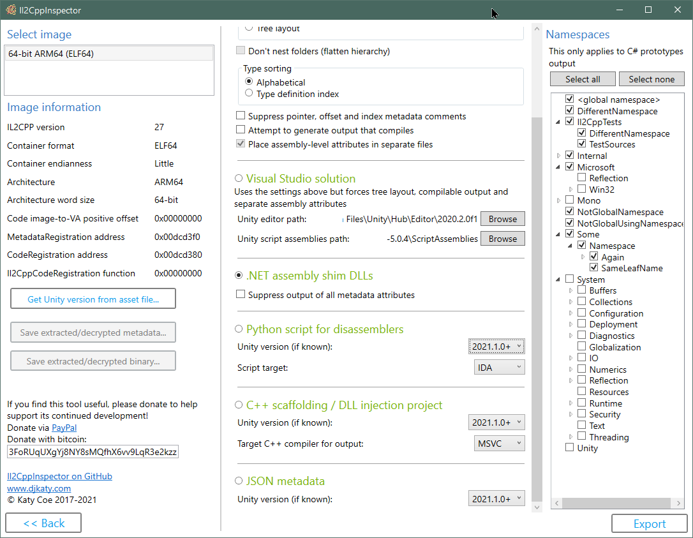
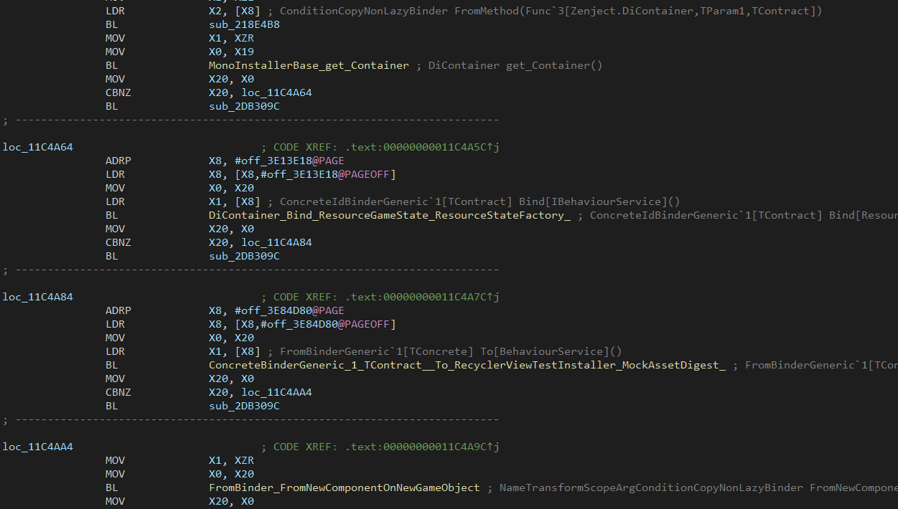
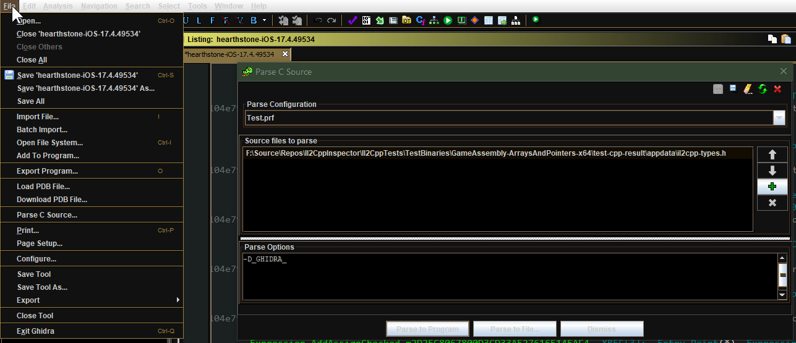
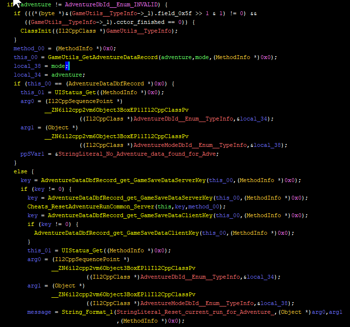
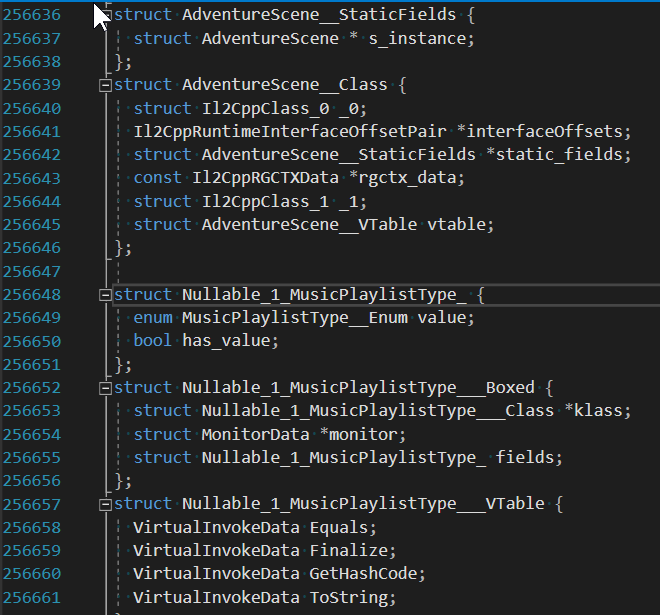
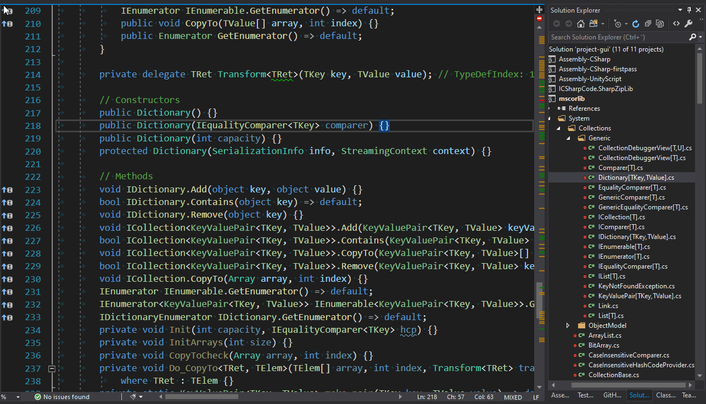
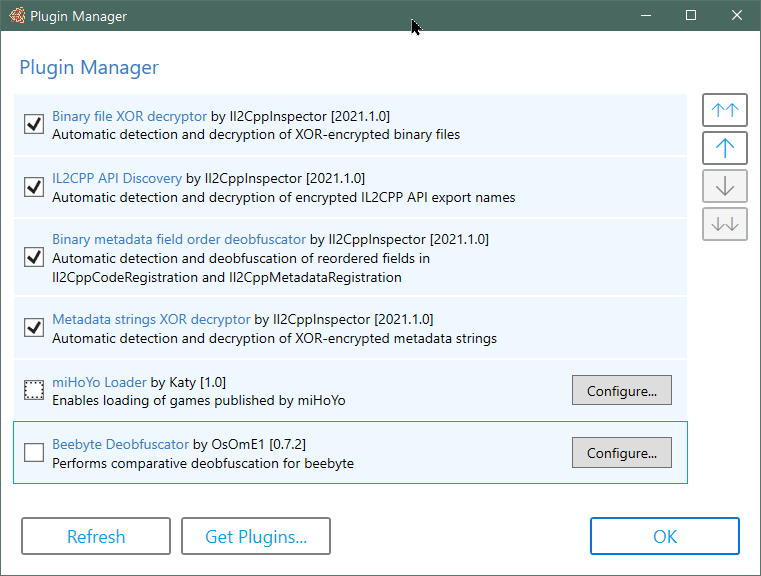

# Development of Il2CppInspector is suspended

It is with great regret that I have to announce that development work on Il2CppInspector has been halted for the foreseeable future.

The reason for this is that due to health and changes in my personal life, I simply do not have time to commit to working on the project anymore. This is very frustrating for me but there is little I can really do about it.

Please feel free to fork the project and make improvements! You can also continue to post issues as I would like to have a compendium of bugs and problems saved in case that I or someone else does have the opportunity to get back to working on this. Please note though, that I won't be responding to issues or PRs going forward for the foreseeable future.

If you need IL2CPP tooling, I recommend my friend and colleague's excellent project [Cpp2IL](https://github.com/SamboyCoding/Cpp2IL) which is a work-in-progress tool to convert IL2CPP binaries directly back into IL code which can be easily viewed in dnSpy etc. This is a mammoth task so please do go and support his work on this amazing project!

Happy hacking,

Katy.

# Il2CppInspector 2021.1

Il2CppInspector helps you to reverse engineer IL2CPP applications, providing the most complete analysis currently available.



### Main features

* Output IL2CPP type definitions, metadata and method pointers as **[C# stub code](#creating-c-prototypes)**

* Create **.NET assembly shim DLLs** containing the IL2CPP application structure and metadata for use in decompilers such as [ILSpy](https://github.com/icsharpcode/ILSpy), [dnSpy](https://github.com/dnSpy/dnSpy), Unity asset loading with [AssetStudio](https://github.com/Perfare/AssetStudio) or managed proxy generation with [Il2CppAssemblyUnhollower](https://github.com/knah/Il2CppAssemblyUnhollower)

* Create **[C++ scaffolding](#creating-c-scaffolding-or-a-dll-injection-project)** for all types, methods, function pointers and API functions in an IL2CPP application for use in x64dbg, Cydia Substrate etc.

* Create **[IDA](#adding-metadata-to-your-ida-workflow) and [Ghidra](#adding-metadata-to-your-ghidra-workflow) Python scripts** to populate symbol, function and type information; includes API hooks to [implement scripts for other targets](#extending-il2cppinspectors-python-output-to-support-other-targets)

* Create Visual Studio **[C++ DLL injection projects](#dll-injection-workflow)** directly from IL2CPP files

* Create Visual Studio **[C# code stub solutions](#creating-a-visual-studio-c-code-stubs-solution)** directly from IL2CPP files

* Create **[JSON metadata](#generating-json-metadata)** with a complete address map directly from IL2CPP Files.

* Create **[IL2CPP binaries from arbitrary C# source code without a Unity project](#universal-il2cpp-build-utility)**

* **[Three major APIs](#using-the-apis-for-programmatic-analysis)** for use in your own custom static analysis projects for querying low level binary metadata, the .NET type model and the whole C++ application. These are also available as a [NuGet Package](https://www.nuget.org/packages/NoisyCowStudios.Il2CppInspector/).

* **[Plugin SDK](#creating-plugins)** allows you to create custom plugins to extend Il2CppInspector's capabilities

* Defeats certain types of obfuscation
  - Most types of packed PE files (Windows DLLs)
  - ROT encryption of API export names
  - Beebyte symbol obfuscation via automated differential analysis (requires [Beebyte Deobfuscator plugin](https://github.com/OsOmE1/Beebyte-Deobfuscator) and an earlier unobfuscated IL2CPP or Mono version of the title)
  - XOR encryption style used in games such as [Arknights](https://play.google.com/store/apps/details?id=com.YoStarEN.Arknights&hl=en_US&gl=US) and [Call of Duty: Mobile](https://play.google.com/store/apps/details?id=com.activision.callofduty.shooter&hl=en_US&gl=US)
  - Striped XOR encryption style used in games such as [Garena Free Fire](https://play.google.com/store/apps/details?id=com.dts.freefireth&hl=en_US&gl=US), [League of Legends: Wild Rift](https://play.google.com/store/apps/details?id=com.riotgames.league.wildrift&hl=en_US&gl=US) and [Legends of Runeterra](https://play.google.com/store/apps/details?id=com.riotgames.legendsofruneterra&hl=en_US&gl=US)
  - String encryption style used in games such as [League of Legends: Wild Rift](https://play.google.com/store/apps/details?id=com.riotgames.league.wildrift&hl=en_US&gl=US)
  - Reordering of registration metadata used in titles by Riot Games
  - Encryption/obfuscation used in titles by miHoYo ([Honkai Impact 3rd](https://honkaiimpact3.mihoyo.com/) and [Genshin Impact](https://genshin.mihoyo.com/)) (requires [miHoYo plugin](https://github.com/djkaty/Il2CppInspectorPlugins/tree/master/Loaders/miHoYo))
  - For other supported obfuscated titles, see the list of [loader plugins](https://github.com/djkaty/Il2CppInspectorPlugins/tree/master/Loaders)
  - Deobfuscated metadata and binary files can be saved back to disk

* Supports **all major file formats and processor architectures**

* Works on Windows, MacOS X and Linux. **Integrated GUI** for Windows users with drag & drop support

* Tested with [every release of IL2CPP](#version-support) since Unity 5.3.0


### Tutorials and Guides

You can read more about how IL2CPP works in my series IL2CPP Reverse Engineering:

#### How IL2CPP works

[Part 1: Hello World and the IL2CPP Toolchain](https://katyscode.wordpress.com/2020/06/24/il2cpp-part-1/)

[Part 2: Structural Overview & Finding The Metadata](https://katyscode.wordpress.com/2020/12/27/il2cpp-part-2/)

#### Il2CppInspector guides

[Il2CppInspector Plugin Development Wiki](https://github.com/djkaty/Il2CppInspector/wiki/Plugins%3A-Getting-Started)

[How to create, use and debug IL2CPP DLL injection projects](https://katyscode.wordpress.com/2020/11/27/il2cppinspector-tutorial-how-to-create-use-and-debug-il2cpp-dll-injection-projects/)

[Working with code in IL2CPP DLL injection projects](https://katyscode.wordpress.com/2021/01/14/il2cppinspector-tutorial-working-with-code-in-il2cpp-dll-injection-projects/)

[Using Il2CppInspector's type model to extract protobuf-net definitions (Case Study: Fall Guys)](https://katyscode.wordpress.com/2020/08/10/practical-il2cpp-protobuf/)

#### Reverse engineering walkthroughs

[Finding loaders for obfuscated global-metadata.dat files](https://katyscode.wordpress.com/2021/02/23/il2cpp-finding-obfuscated-global-metadata/) - explains how to find the loader, deobfuscation and/or decryption code for `global-metadata.dat` in almost any IL2CPP application

[Enable loading of League of Legends: Wild Rift](https://katyscode.wordpress.com/2021/01/15/reverse-engineering-adventures-league-of-legends-wild-rift-il2cpp/) - covers XOR decryption, XOR string decryption, API export ROT decryption, data obfuscation of binary metadata

[Enable loading of Honkai Impact (3 parts)](https://katyscode.wordpress.com/2021/01/17/reverse-engineering-adventures-honkai-impact-3rd-houkai-3-il2cpp-part-1/) - covers finding functions in an image, data obfuscation of global-metadata.dat, IDA decompiler techniques, how to write a plugin

[VMProtect control flow obfuscation in Honkai Impact](https://katyscode.wordpress.com/2021/01/23/reverse-engineering-adventures-vmprotect-control-flow-obfuscation-case-study-string-algorithm-cryptanalysis-in-honkai-impact-3rd/) - covers extrapolating the code path from a function with control flow flattening using x64dbg and the IDA decompiler

[Reverse engineering Genshin Impact with PowerShell](https://katyscode.wordpress.com/2021/01/24/reverse-engineering-adventures-brute-force-function-search-or-how-to-crack-genshin-impact-with-powershell/) - covers writing a test harness to find a function in an obfuscated binary via brute-force attack / reverse fuzzing

### Other features

File format and architecture support:

* Supports ELF (Android .so), PE (Windows .exe), Mach-O (Apple iOS/Mac), Universal Binary (Fat Mach-O) and FSELF (PlayStation 4 .prx/.sprx) file formats
* Also supports single and split APK (Android), AAB (Android App Bundle), XAPK, Zip and decrypted IPA (iOS) application package files as input
* Supports ELF files created from memory dumps
* Supports Linux process maps + corresponding .bin files - such as those produced by GameGuardian - without the need to manually extract the IL2CPP binary
* 32-bit and 64-bit support for all file formats
* Supports ARMv7, Thumb-2, ARMv8 (A64), x86 and x64 architectures regardless of file format
* Supports applications created with Unity 5.3.0 onwards (full IL2CPP version table below)

Nice to have:

* Support for assemblies, classes, methods, constructors, fields, properties, enumerations, events, interfaces, structs, pointers, references, attributes, nested types, generic types, generic methods, generic constraints, default field values and default method parameter values
* C# syntactic sugar for CTS value types, compiler-generated types, delegates, extension methods, operator overloading, indexers, user-defined conversion operators, explicit interface instantiations, finalizers, nullable types, unsafe contexts, fixed-size arrays, variable length argument lists, method hiding and escaped strings
* Partition C# code output by namespace, assembly, class, full tree or single file; sort by index or type name; output flat or nested folder hierarchy. Each file includes the necessary `using` directives. Scope and type name conflicts are resolved automatically to produce code that compiles.
* API function export processing for PE, ELF, Mach-O and SELF (PRX) binaries
* Symbol table processing and name demangling for ELF and Mach-O binaries 
* Relocation processing for ELF binaries
* Automatically defeats certain basic obfuscation methods
* Test chassis for automated integration testing of IL2CPP binaries

Class library targets .NET Core 3.1. Built with Visual Studio 2019.

**NOTE**: Il2CppInspector is not a decompiler. It can provide you with the structure of an application and function addresses for every method so that you can easily jump straight to methods of interest in your disassembler. It does not attempt to recover the entire source code of the application.

### Build instructions

```
git clone --recursive https://github.com/djkaty/Il2CppInspector
cd Il2CppInspector
```

##### Windows

Build the CLI and Windows GUI versions:

```
dotnet publish -c Release
```

Get all current plugins (optional):

```
powershell -f get-plugins.ps1
```

##### Mac OS X

Build the CLI version:

```
cd Il2CppInspector.CLI
dotnet publish -r osx-x64 -c Release
```

Get all current plugins (optional):

```
../get-plugins.sh
```

##### Linux

Build the CLI version:

```
cd Il2CppInspector.CLI
dotnet publish -r linux-x64 -c Release
```

Get all current plugins (optional):

```
../get-plugins.sh
```

For other operating systems supporting .NET Core, add  `-r xxx` to the final command where `xxx` is a RID from https://docs.microsoft.com/en-us/dotnet/articles/core/rid-catalog

The output binary for command-line usage is placed in `Il2CppInspector/Il2CppInspector.CLI/bin/Release/netcoreapp3.0/[win|osx|linux]-x64/publish/Il2CppInspector.exe`.

The output binary for Windows GUI is placed in `Il2CppInspector/Il2CppInspector.GUI/bin/Release/netcoreapp3.1/[win|osx|linux]-x64/publish/Il2CppInspector.exe`.

The `plugins` folder should be placed in the same folder as `Il2CppInspector.exe`.


### Command-line Usage

Run `Il2CppInspector.exe` at the command prompt.

File format and architecture are automatically detected.

All outputs are generated by default. To generate only specific outputs, use the `--select-outputs` switch in combination with the output selection switches.

```
  -i, --bin                   (Default: libil2cpp.so) IL2CPP binary, APK, AAB, XAPK, IPA, Zip or Linux process map text input file(s) (single file or comma-separated list for split APKs)

  -m, --metadata              (Default: global-metadata.dat) IL2CPP metadata file input (ignored for APK/AAB/XAPK/IPA/Zip)

  --image-base                For ELF memory dumps, the image base address in hex (ignored for standard ELF files and other file formats)

  --select-outputs            Only generate outputs specified on the command line (use --cs-out, --py-out, --cpp-out, --json-out, --dll-out to select outputs). If not specified, all outputs are generated

  -c, --cs-out                (Default: types.cs) C# output file (when using single-file layout) or path (when using per namespace, assembly or class layout)

  -p, --py-out                (Default: il2cpp.py) Python script output file

  -h, --cpp-out               (Default: cpp) C++ scaffolding / DLL injection project output path

  -o, --json-out              (Default: metadata.json) JSON metadata output file

  -d, --dll-out               (Default: dll) .NET assembly shim DLLs output path

  --metadata-out              IL2CPP metadata file output (for extracted or decrypted metadata; ignored otherwise)

  --binary-out                IL2CPP binary file output (for extracted or decrypted binaries; ignored otherwise; suffixes will be appended for multiple files)

  -e, --exclude-namespaces    (Default: System Mono Microsoft.Reflection Microsoft.Win32 Internal.Runtime Unity UnityEditor UnityEngine UnityEngineInternal AOT JetBrains.Annotations) Comma-separated list of namespaces to suppress in C# output, or 'none' to include all namespaces

  -l, --layout                (Default: single) Partitioning of C# output ('single' = single file, 'namespace' = one file per namespace in folders, 'assembly' = one file per assembly, 'class' = one file per class in namespace folders, 'tree' = one file per class in assembly and
                              namespace folders)

  -s, --sort                  (Default: index) Sort order of type definitions in C# output ('index' = by type definition index, 'name' = by type name). No effect when using file-per-class or tree layout

  -f, --flatten               Flatten the namespace hierarchy into a single folder rather than using per-namespace subfolders. Only used when layout is per-namespace or per-class. Ignored for tree layout

  -n, --suppress-metadata     Diff tidying: suppress method pointers, field offsets and type indices from C# output. Useful for comparing two versions of a binary for changes with a diff tool

  --suppress-dll-metadata     Diff tidying: suppress method pointers, field offsets and type indices attributes from DLL output. Useful for comparing two versions of a binary for changes

  -k, --must-compile          Compilation tidying: try really hard to make code that compiles. Suppress generation of code for items with CompilerGenerated attribute. Comment out attributes without parameterless constructors or all-optional constructor arguments. Don't emit
                              add/remove/raise on events. Specify AttributeTargets.All on classes with AttributeUsage attribute. Force auto-properties to have get accessors. Force regular properties to have bodies. Suppress global::Locale classes. Generate dummy parameterless
                              base constructors and ref return fields.

  --separate-attributes       Place assembly-level attributes in their own AssemblyInfo.cs files. Only used when layout is per-assembly or tree

  -j, --project               Create a Visual Studio solution and projects. Implies --layout tree, --must-compile and --separate-attributes

  --cpp-compiler              (Default: BinaryFormat) Compiler to target for C++ output (MSVC or GCC); selects based on binary executable type by default

  -t, --script-target         (Default: IDA) Application to target for Python script output (IDA or Ghidra) - case-sensitive

  --unity-path                (Default: C:\Program Files\Unity\Hub\Editor\*) Path to Unity editor (when using --project). Wildcards select last matching folder in alphanumeric order

  --unity-assemblies          (Default: C:\Program Files\Unity\Hub\Editor\*\Editor\Data\Resources\PackageManager\ProjectTemplates\libcache\com.unity.template.3d-*\ScriptAssemblies) Path to Unity script assemblies (when using --project). Wildcards select last matching folder in
                              alphanumeric order

  --unity-version             Version of Unity used to create the input files, if known. Used to enhance Python, C++ and JSON output. If not specified, a close match will be inferred automatically.

  --unity-version-from-asset  A Unity asset file used to determine the exact Unity version. Overrides --unity-version.

  --plugins                   Specify options for plugins. Enclose each plugin's configuration in quotes as follows: --plugins "pluginone --option1 value1 --option2 value2" "plugintwo --option...". Use --plugins <name> to get help on a specific plugin

  --help                      Display this help screen.

  --version                   Display version information.
```

### File format considerations

**Apple Universal Binaries and APKs/XAPKs with binaries for multiple architectures**: when using the CLI, multiple output files will be generated, with each filename besides the first suffixed by the index of the image in the binary. Unsupported images will be skipped.

**IPA packages**: the executable must be decrypted first. Encrypted executable binaries are not supported.

**Split APK packages**: when using the CLI, specify a list of APK files with a comma between each filename.

**ELF binaries created from memory dumps**: specify the image base (in hex) using `--image-base`. If the supplied image base is incorrect, the application may crash.

**GameGuardian dumps (and other Linux process map dumps)**: you can use a `*-maps.txt` file in place of an IL2CPP binary. Il2CppInspector will scan the folder containing the maps file for matching `.bin` files and reassemble and rebase `libil2cpp.so` automatically. You therefore don't need to create the file manually or provide an image base address when using this kind of dump. For this to work, neither the text file nor any of the binary files must be renamed, and all must be in the same folder.

**Packed PE files (DLLs)**: **WARNING: Loading a packed PE file will cause the DLL's entry point and initialization functions to execute. Do not load malicious DLLs and never run Il2CppInspector as an administrator when handling packed PE files. USE AT YOUR OWN RISK.**

### Creating C# prototypes

Il2CppInspector can create C# code stub files with pointer metadata to allow you to explore the IL2CPP binary in an easy-to-read format.

Specify the `-c` switch to choose the C# output file or path.

To exclude types from certain namespaces from being generated in the C# source file output, provide a comma-separated list of case-sensitive namespaces in `--exclude-namespaces`. The following namespaces will be excluded if no argument is specified:

```
System
Mono
Microsoft.Reflection
Microsoft.Win32
Internal.Runtime
Unity
UnityEditor
UnityEngine
UnityEngineInternal
AOT
JetBrains.Annotations
```

Providing an argument to `--exclude-namespaces` will override the default list. To output all namespaces, use `--exclude-namespaces=none`. This only applies to C# prototypes output.

You can specify the output layout with the `--layout` switch:

* `single` - all types in a single file
* `namespace` - one namespace per file (each file will be given the namespace name)
* `assembly` - one assembly per file (each file will be given the assembly name)
* `class` - one class per file
* `tree` - one class per file in a tree-like folder structure with top-level assembly folders and second-level namespace folders

You can specify the intra-file type ordering with the `--sort` switch:

* `index` - sort by type definition index as found in the IL2CPP metadata
* `name` - sort alphabetically by type name

This switch has no effect when using `class` or `tree` layout.

The `--flatten` switch allows you to flatten a hierarchy of nested namespaces when `layout` is `class` or `namespace`, ie. a series of sub-folders `System/IO/Compression` will instead be a single top-level sub-folder `System.IO.Compression`.

The `--suppress-metadata` switch allows you to suppress the output of comments including method pointers, field offsets and type indices. This is useful when you want to diff the changes between two versions of an application to see only which types have changed.

The `--seperate-attributes` switch directs Il2CppInspector to put assembly-level attributes in their own `AssemblyInfo.cs` files rather than at the top of the first file generated for each assembly, when `layout` is `assembly` or `tree`.

### Adding metadata to your IDA workflow

Simply run Il2CppInspector with the `-p` switch to choose the IDA script output file. Load your binary file into IDA, press Alt+F7 and select the generated script. Observe the Output Window while IDA analyzes the file - this may take a long time.

Three files are generated by Il2CppInspector for IDAPython: the Python script itself, a JSON metadata file and a C++ type header file (this is `cpp/appdata/il2cpp-types.h` by default if you used the CLI, or `il2cpp.h` if you used the GUI). These files must be present for the script to run successfully.

If you know which version of Unity the binary was compiled with, you can improve the output by specifying this with `--unity-version`, for example `--unity-version 2019.3.1f1`. You can also supply any asset file from the application to detect the Unity version with `--unity-version-from-asset`. Otherwise Il2CppInspector will make an educated guess based on the contents of the binary.

Il2CppInspector generates the following data for IDA projects:

- Type declarations for all IL2CPP internal types
- Type declarations for every type in the IL2CPP application including generic instances
- Addresses for every known type
- Names for all regular .NET methods
- Names for all constructed generic methods
- Names and typed signatures for all IL2CPP custom attributes generator functions
- Names, .NET argument type lists and typed signatures for all IL2CPP runtime invoker functions for both regular and constructed generic methods (per-signature Method.Invoke endpoints)
- Function boundaries for all of the above
- Comments at each function entry point with .NET method signatures for all of the above
- Names and type declarations for all of the following IL metadata references: Type, TypeInfo, MethodDef, FieldInfo, StringLiteral, MethodRef (this includes all generic class and method instantiation metadata)
- Comments for all IL string literal metadata pointers containing the value of the string
- Names and types for some IL2CPP-specific data structures and functions
- Names and typed signatures for all IL2CPP API functions that could be identified

Example IDA C++ decompilation after applying Il2CppInspector (initialization code omitted for brevity):



### Adding metadata to your Ghidra workflow

Run Il2CppInspector with the `-p` switch to choose the Ghidra script output file, and `-t Ghidra` (case-sensitive) to specify Ghidra as the script type you wish to produce.

Three files are generated by Il2CppInspector for Ghidra: the Python script itself, a JSON metadata file and a C++ type header file. These files must be present for the script to run successfully.

If you know which version of Unity the binary was compiled with, you can improve the output by specifying this with `--unity-version`, for example `--unity-version 2019.3.1f1`. You can also supply any asset file from the application to detect the Unity version with `--unity-version-from-asset`. Otherwise Il2CppInspector will make an educated guess based on the contents of the binary.

**NOTE:** For best results, choose No when Ghidra asks if you would like to perform auto-analysis when the binary is first loaded. If you receive a `Conflicting data exists at address` error when running the script below, re-load the binary into the project and choose No at the auto-analysis prompt.

**NOTE:** To significantly speed up analysis for ELF files, set the image base to zero (`0x00000000`) in the load options for the binary. For compatibility reasons, executing the Ghidra Python script on an ELF file will change the file's image base to zero for you if necessary, however if the current image base is non-zero this may take a very long time to complete. Other file formats will retain the same image base.

To import metadata into an existing Ghidra project:

1. From the _Code Browser_, choose _File -> Parse C Source..._
2. Create a new profile and add the generated C++ type header file. This is `cpp/appdata/il2cpp-types.h` by default if you used the CLI, or `il2cpp.h` if you used the GUI.
3. Ensure the _Parse Options_ are set exactly as follows:

   `-D_GHIDRA_`

4. Click Parse to Program and accept any warnings. This may take a long time to complete.
5. Open the _Script Manager_ and add the output folder you chose in Il2CppInspector as a script folder.
6. If you have used scripts from Il2CppInspector for other binaries, ensure the Python files are named differently, or disable use of the previous script folder(s).
7. Click Refresh to make the script appear in _Script Manager_.
8. Right-click the script and choose _Run_. This may take a while to complete.



Il2CppInspector generates identical data for Ghidra projects as it does for IDA - see the above section for details.

Example Ghidra C++ decompilation after applying Il2CppInspector:



### Creating C++ scaffolding or a DLL injection project

Il2CppInspector generates a series of C++ source files which you can use in a variety of ways, for example:

- with a tool like x64dbg to analyze the memory of the application at runtime
- with a tool like Cydia Substrate (MSHookFunction) for accessing types, methods and IL2CPP API functions
- to run custom code via DLL injection on Windows (see below)

Run Il2CppInspector with the `-h` switch to choose the C++ output folder.

If you know which version of Unity the binary was compiled with, you can improve the output by specifying this with `--unity-version`, for example `--unity-version 2019.3.1f1`. You can also supply any asset file from the application to detect the Unity version with `--unity-version-from-asset`. Otherwise Il2CppInspector will make an educated guess based on the contents of the binary.

You can target which C++ compiler you wish to use the output files with: specify `--cpp-compiler MSVC` for Visual Studio and `--cpp-compiler GCC` for gcc or clang.

Il2CppInspector performs automatic name conflict resolution to avoid the use of pre-defined symbols and keywords in C++, and to handle re-definition of same-named symbols in the application.

Some IL2CPP binary files contain only a partial set of API exports, or none at all. For these cases, Il2CppInspector will build scaffolding using only the available exports to ensure that the project compiles successfully.



The following files are generated:

- `appdata` - this folder contains project-agnostic binary-specific declarations:
    - `ilc2pp-types.h`:
      - Type declarations for all internal IL2CPP types (a minimal version of the Unity headers)
      - Type declarations for every type used in the application including all arrays, enums, concrete generic type instances and inferred usages from metadata.
      - Boxed versions for types where applicable
      - VTables for every type

    - `il2cpp-functions.h`:
      - The function pointer signature and offset from the image base address to every C#-equivalent method
      - The offset from the image base address to every method information class (`MethodInfo **`)

    - `il2cpp-types-ptr.h`:
      - The offset from the image base address to every type information class (`Il2CppClass **`)

    - `il2cpp-api-functions.h`:
      - The function pointer signature to every IL2CPP API function (copied directly from Unity for the version used to compile the binary). Functions not found in the binary's export list will be elided

    - `il2cpp-api-functions-ptr.h`:
      - The offset from the image base address to every IL2CPP API function export (functions starting with `il2cpp_`)

    - `il2cpp-metadata-version.h`:
      - A `#define` for the IL2CPP version used by the target binary

The above files contain all the data needed for dynamic analysis in a debugger.

In addition, the following files are generated for DLL injection:

- `framework` - project-agnostic binary-agnostic boilerplate code and scaffolding:
    - `dllmain.cpp`:
      - Provides a DLL injection stub which calls `init_il2cpp()` (see below) and starts `Run()` (see below) in a new thread

    - `helpers.cpp` and `helpers.h`:
      - Provides various helper functions. See the comments in `helpers.h` for details.

    - `il2cpp-init.cpp`, `il2cpp-init.h` and `il2cpp-appdata.h`:
      - Provides the `void init_il2cpp()` function which uses all of the above headers to generate usable function pointers and class pointers that are mapped to the correct places in the in-memory image at runtime

    - `pch-il2cpp.cpp` and `pch-il2cpp.h`:
      - Provides the necessary scaffolding to enable pre-compiled headers (PCH) for all of the headers in the `appdata` folder

- `user` - project-specific binary-agnostic user code which you can modify as desired:
    - `main.cpp` and `main.h`:
      - Contains a stub `Run()` function which denotes the entry point for your custom injected code. The function executes in a new thread and therefore does not block `DllMain`.

  **This is the only folder whose files you should edit**.

For Visual Studio users, the following files are also generated:

- `IL2CppDLL.vcxproj`, `Il2CppDLL.vcxproj.filters` and `Il2CppDLL.sln`:
  - The project and solution files for a DLL injection project. The first time you load the solution into Visual Studio, you will be asked to re-target the platform SDK and C++ toolchain. Accept the default suggestions. **WARNING: Compilation may fail if you don't do this.**

The default `main.cpp` includes commented code to allow you to write to a log or open a new console using the functions from `helpers.h`. To specify a log file target in your source code, use `extern const LPCWSTR LOG_FILE = L"my_log_file.txt"`.

**Tip:** When a new version of the target application is released, you can re-output the C++ scaffolding project in-place. The `appdata` and `framework` folders will be overwritten but the `user` folder and project/solution files will not be changed. This makes it easy to update your project when the target application has been updated!

**Compatibility:** It is recommended to use Visual Studio 2019 (MSVC++ Build Tools v142 or later). The scaffolding projects have been tested with Visual Studio 2019 and Visual Studio 2017 (MSVC++ Build Tools v141), however some helper code is omitted when using Visual Studio 2017 in order to enable compilation to succeed.

#### DLL Injection workflow

1. Use Il2CppInspector to create C++ scaffolding output for the executable binary of interest
2. Load the generated solution (`Il2CppDLL.sln`) into Visual Studio
3. Add the code you wish to execute in the `Run()` function in `main.cpp`
4. Compile the project
5. Use a DLL injection tool such as [Cheat Engine](https://www.cheatengine.org/) or [RemoteDLL](https://securityxploded.com/remotedll.php) to inject the compiled DLL into the IL2CPP application at runtime

You have access to all of the C#-equivalent types and methods in the application, plus all of the available IL2CPP API functions. No additional function pointer or type declarations are required.

Example (create a `Vector3` and log its y co-ordinate to a file):

```cpp
// in main.cpp
void Run()
{
    // Vector3 example

    // (Call an IL2CPP API function)
    Vector3__Boxed* myVector3 = (Vector3__Boxed*) il2cpp_object_new((Il2CppClass*) *Vector3__TypeInfo);

    // (Call an instance constructor)
    Vector3__ctor(myVector3, 1.0f, 2.0f, 3.0f, NULL);

    // (Access an instance field)
    il2cppi_log_write(to_string(myVector3->fields.y));
}
```

More detailed tutorials can be found here: 

[How to create, use and debug IL2CPP DLL injection projects](https://katyscode.wordpress.com/2020/11/27/il2cppinspector-tutorial-how-to-create-use-and-debug-il2cpp-dll-injection-projects/)

[Working with code in IL2CPP DLL injection projects](https://katyscode.wordpress.com/2021/01/14/il2cppinspector-tutorial-working-with-code-in-il2cpp-dll-injection-projects/)

### Creating a Visual Studio C# code stubs solution

Il2CppInspector can create a complete Visual Studio workspace with a solution (.sln) file, project (.csproj) files and assembly-namespace-class tree-like folder structure. Each project creates a single assembly.

Use the `--project` switch to generate a solution workspace.

In order for Il2CppInspector to be able to create .csproj files which contain the correct Unity assembly references, you must provide the path to an installed Unity editor and a project template or `ScriptAssemblies` folder of an existing Unity project.

NOTE: The default settings will select the latest installed version of Unity and the latest installed version of the default 3D project template, if they have been installed in the default location.

Typical Unity editor location (specified with `--unity-path`): *C:\Program Files\Unity\Hub\Editor\20xx.y.z*

Typical Unity project template location (specified with `--unity-assemblies`): *C:\Program Files\Unity\Hub\Editor\20xx.y.z\Editor\Data\Resources\PackageManager\ProjectTemplates\libcache\\\<name-of-template>*

Typical Unity script assemblies location in existing project (specified with `--unity-aseemblies`): *X:\MyProject\Library\ScriptAssemblies*

Replace *x*, *y* and *z* with your Unity version number. Replace *\<name-of-template\>* with the desired template.

NOTE: You can use the asterisk wildcard (*) one or more times when specifying these paths. Il2CppInspector will select the last matching folder in alphanumeric order. This is useful if you have multiple side-by-side Unity installs and wish to always select the latest version or template.

In the event that the assembly references are not correctly resolved the first time you load a solution, simply close and re-open the solution to force them to be resolved.



### Generating JSON metadata

Il2CppInspector can create a JSON file containing various metadata about the application.

Use the `-o` switch to specify the JSON output path.

The output schema is as follows:

- `addressMap` (object)

  An address map of all IL2CPP-related content in binary
    - `methodDefinitions` (array)
      The virtual address, binary symbol, C++ function signature and .NET method signature of every .NET-equivalent method in the binary

    - `constructedGenericMethods` (array)
      The virtual address, binary symbol, C++ function signature and .NET method signature of every .NET-equivalent concrete generic method in the binary

    - `customAttributesGenerators` (array)
      The virtual address, name and C++ function signature of every custom attributes generator function in the binary

    - `methodInvokers` (array)
      The virtual address, name and C++ function signature of every Method.Invoke thunk function in the binary

    - `stringLiterals` (array)
      For Unity versions lower than 5.3.2: the ordinal, name and text of every string literal in the binary
      For Unity version 5.3.2 and later: the virtual address, name and text of every string literal in the binary

    - `typeInfoPointers` (array)
      The virtual address, name, C++ derived type name and .NET type name equivalent of every class definition pointer (`Il2CppClass *`) in the binary

    - `typeRefPointers` (array)
      The virtual address, name and .NET type name equivalent of every type reference pointer (`Il2CppType *`) in the binary

    - `methodInfoPointers` (array)
      The virtual address, name and .NET method signature of every runtime method definition pointer (`MethodInfo *`) in the binary

    - `functionAddresses` (array)
      The virtual addresses of the start of every known function in the binary, including all of those above plus any others detected but not included in the above categories

    - `typeMetadata` (array)
      The virtual address, name and C++ type name of key metadata items in the binary. This includes `Il2CppCodeRegistration` and `Il2CppMetadataRegistration`, and depending on the binary version may also include a pointer to each `Il2CppCodeGenModule`

    - `arrayMetadata` (array)
      The virtual address, name, C++ type name and size of key metadata arrays in the binary

    - `functionMetadata` (array)
      The virtual address, name and C++ function signature of key metadata functions in the binary. Depending on how the binary was analyzed by Il2CppInspector, this may include `il2cpp_codegen_register`.

    - `apis` (array)
      The virtual address, name and C++ function signature of every IL2CPP API function identified in the binary

    - `exports` (array)
      The virtual address and name of every export in the binary

    - `symbols` (array)
      The virtual address, name and symbol type of every named (non-zero name length) and non-zero address function definition, type, field name and import (for ELF) defined in the binary. Not currently supported for PE files.

### Universal IL2CPP Build Utility

Three Powershell scripts are provided to enable easy building and testing of IL2CPP binaries:

* `il2cpp.ps1` is the main workhorse and compiles each specified C# source file in `TestSources` (or all of them if none supplied) as a separate assembly, and outputs them to `TestAssemblies`. It then takes every specified assembly in `TestAssemblies` and compiles each one as a separate IL2CPP project for each of these architectures:

  - Windows x86 standalone
  - Windows x64 standalone
  - Android ARMv7 (32-bit)
  - Android ARMv8-A (64-bit)
   
  These are placed into the `TestBinaries` folder. The C++ source code for each build is placed into the `TestCpp` folder. It then calls `generate-tests.ps1`.

  Specify a comma-separated list of source files (without the `.cs` extension) to process as the first argument (or `-assemblies`).

  You can optionally specify a Unity version or Unity install path with the 2nd argument (or `-unityVersion`). If none is supplied, the latest installed Unity version will be used. You can also specify wildcards, eg. `2019*` will use the latest installed version of Unity 2019, `2018.3*` will use the latest installed version of Unity 2018.3 etc. Use Unity Hub to install the desired versions.

   Therefore with one command you can generate an assembly DLL, C++ source code and IL2CPP binary for each architecture for any given list of source files, one set of outputs per source file, for a specified version of Unity.

* `generate-tests.ps1` generates a file called `Tests.cs` in the `Il2CppTests` project, containing one test per IL2CPP project in `TestBinaries`. This file will be compiled by the `Il2CppTests` project. You will then be able to see one test per IL2CPP project in Visual Studio's Test Explorer.

  The auto-generated tests generate C#, JSON and C header files in the test IL2CPP binary's folder in `TestBinaries` (each filename prefixed with `test`) and compares them (whitespace-insensitive) with the corresponding project name files in `TestExpectedResults`. In this way, you can check for files with known structure that the analysis is being performed correctly, or step through the analysis of specific binaries in the debugger without having to change the project's command-line arguments.

* `update-expected-results.ps1` copies all of the output test results from `TestBinaries` into `TestExpectedResults`, therefore updating the files that will be used to verify correct test results.

Example uses:

`./il2cpp.ps1`

builds each C# source file ìnto a .NET assembly DLL, a C++ source folder and one IL2CPP binary per supported architecture

`./il2cpp.ps1 MyFirstTest`

builds `MyFirstTest.cs` into `MyFirstTest.dll`, creates a C++ source folder named `MyFirstTest` and an IL2CPP binary for each supported architecture

`./il2cpp.ps1 MyFirstTest,MySecondTest 2019.3.1f1`

builds `MyFirstTest.cs` and `MySecondTest.cs` into individual assembly DLLs, C++ source folders and IL2CPP binaries, using Unity 2019.3.1f1

`./il2cpp.ps1 MyFirstTest,MySecondTest F:\Unity\Hub\Editor\2019.3.1f1`

as above but specifies a custom path for your Unity installation.

The minimum supported Unity version is 2017.1.0f3.

To learn more about these features, see the section entitled **Using Il2CppInspector to generate IL2CPP code** in [IL2CPP Reverse Engineering Part 1](https://katyscode.wordpress.com/2020/06/24/il2cpp-part-1/).

### Using the APIs for programmatic analysis

**NOTE: _The Il2CppInspector APIs are also available as a [NuGet package](https://www.nuget.org/packages/NoisyCowStudios.Il2CppInspector/)! (search: NoisyCowStudios.Il2CppInspector)_**

Il2CppInspector offers the following re-usable class library APIs:

* **Il2CppInspector** - low-level access to the binary image and metadata
* **TypeModel** - high-level .NET Reflection-like query API for all of the .NET types in the source project as a tree model
* **AppModel** - access to all of the C++ types and methods, plus the IL2CPP API exports, with detailed address and offset data and mappings to their .NET equivalents

Use these APIs to easily query IL2CPP types, create new output modules and integrate Il2CppInspector with your own static analysis applications.

To utilize Il2CppInspector in your own projects, add a reference to `Il2CppInspector.Common.dll`.

Include the following `using` directives:

* `using Il2CppInspector` to use `Il2CppInspector`.
* `using Il2CppInspector.Reflection` to use `TypeModel`.
* `using Il2CppInspector.Model` to use `AppModel`.

See the source code for further details or the tutorials above.

### Using plugins

Plugins should be placed in the `plugins` folder in the same folder as `Il2CppInspector.exe`. Each plugin should be placed into its own sub-folder with any dependencies or configuration files needed.

From the GUI you can enable and disable plugins, change the execution order and configure individual plugin settings via the _Manage plugins..._ button.

From the CLI you can specify which plugins and settings to use as follows.

For one plugin:

`Il2CppInspector.exe --plugins "myplugin --firstOption value1 --secondOption value2"`

For multiple plugins:

`Il2CppInspector.exe --plugins "plugin1 --option1 ..." "plugin2 --option2 ..." ...`

Plugins will be executed in the order specified.

Core plugins (those that are part of Il2CppInspector's base functionality) are always enabled when using the CLI, but can be disabled in the GUI.

When using the CLI, core plugins always execute first by default. You can force the core plugins to execute in a different order by specifying their names in the desired execution order. For example:

`Il2CppInspector.exe --plugins "analytics --output foo.csv"`

will run the core plugins first then the `analytics` example plugin, but:

`Il2CppInspector.exe --plugins "analytics --output foo.csv" "xor"`

will cause the `xor` core plugin to run after `analytics`.

For help on a specific plugin, specify the plugin name with no arguments:

`Il2CppInspector.exe --plugins myplugin`

To get more plugins, click _Get Plugins_ in the Manage Plugins window in the GUI, visit the [Il2CppInspectorPlugins repository](https://github.com/djkaty/Il2CppInspectorPlugins) or use the `get-plugins.ps1` or `get-plugins.sh` scripts to update to the latest plugin releases.



### Creating plugins

Plugins let you extend the functionality of Il2CppInspector. For example you can pre and post-process metadata and binaries to enable inspection of IL2CPP applications that Il2CppInspector cannot handle automatically.

Plugin support is currently experimental and has limited functionality.

Details on how to create your own plugins can be found in the [Il2CppInspector Plugin Development Wiki](https://github.com/djkaty/Il2CppInspector/wiki/Plugins%3A-Getting-Started).

You can find out more about plugins, and browse the source code of current plugins and examples in the [Il2CppInspectorPlugins repository](https://github.com/djkaty/Il2CppInspectorPlugins).

### Extending Il2CppInspector's Python output to support other targets

The current version of Il2CppInspector can output Python scripts targeting the IDA and Ghidra disassemblers.

When Il2CppInspector generates such a script, it generates a concatenation of a shared block of code (`Outputs/ScriptResources/shared-main.py`) which parses the JSON metadata and dispatches it to a set of implementation-specific functions to be processed, and a block of code specific to the target application which implements these functions (a file from `Outputs/ScriptResources/Targets`).

If you would like to add support for a new target application, create a new Python script in `Outputs/ScriptResources/Targets` with the nane `<target-name-without-whitespace>.py` and implement the following functions:

- `CustomInitializer()` - perform any custom initialization required for the target before applying the metadata
- `DefineCode(code)` - parse and apply the specified C++ declaration text (this is not required for Unity 5.3.2 and later; if you don't need to support earlier versions, just specify `pass` as the implementation)
- `GetScriptDirectory()` - retrieve the directory that the Python script is running in. This will normally be `os.path.dirname(os.path.realpath(__file__))`
- `MakeFunction(start, name=None)` - define address `start` as the start of a function, optionally with name `name`
- `SetComment(addr, text)` - place the comment `text` at address `addr`
- `SetFunctionType(addr, sig)` - parse the C++ function signature in `sig` and apply it to the function at address `addr`
- `SetHeaderComment(addr, text)` - place the header/plate/pre-item comment `text` at address `addr`
- `SetName(addr, name)` - set the symbol (or label or name) of address `addr` to `name`
- `SetType(addr, type)` - define address `addr` to be an item of the C++ type `type`

Refer to the source code of `IDA.py` and `Ghidra.py` for examples.

When you add a new target and re-compile Il2CppInspector:

- the target will automatically be available for selection via the `-t` (`--script-target`) switch via the CLI
- the target will automatically appear in the drop-down selection box for script targets in the GUI

If you develop an API for a target that you think might be useful to others, please feel free to submit a PR with the code!

### Version support

Unity version | IL2CPP version | Support
--- | --- | ---
4.6.1+ | First release | Unsupported
5.2.x | 15 | Unsupported
5.3.0-5.3.1 | 16 | Working
5.3.2 | 19 | Working
5.3.3-5.3.4 | 20 | Working
5.3.5-5.4.6 | 21 | Working
5.5.0-5.5.6 | 22 | Working
5.6.0-5.6.7 | 23 | Working
2017.1.0-2018.2.21 | 24 | Working
2018.3.0-2018.4.x | 24.1 | Working
2019.1.0-2019.3.6 | 24.2 | Working
2019.3.7-2019.4.14 | 24.3 | Working
2019.4.15-2019.4.20 | 24.4 | Working
2019.4.21-2019.4.x | 24.5 | Working
2020.1.0-2020.1.10 | 24.3 | Working
2020.1.11-2020.1.17 | 24.4 | Working
2020.2.0-2020.2.3 | 27 | Working
2020.2.4-2020.3.x | 27.1 | Working
2021.1.0-2021.1.x | 27.2 | Partial

Please refer to the companion repository https://github.com/nneonneo/Il2CppVersions if you would like to track the changes between each IL2CPP release version.

### Problems

If you have files that don't work or are in an unsupported format, please open a new issue on GitHub and attach a sample with details on the file format, and I'll try to add support. Include both the IL2CPP binary and `global-metadata.dat` in your submission.

Please check the binary file in a disassembler to ensure that it is a plain IL2CPP binary before filing an issue. Il2CppInspector is not intended to handle packed, encrypted or obfuscated IL2CPP files.

### Support

If you found Il2CppInspector useful, you can really help support the project by making a small donation at http://paypal.me/djkaty!

You can also donate with bitcoin: 3FoRUqUXgYj8NY8sMQfhX6vv9LqR3e2kzz

Much love! - Katy

### Acknowledgements

Thanks to the following major contributors!

- nneonneo - https://github.com/nneonneo (huge overhaul of generics and script generation)
- carterbush - https://github.com/carterbush (IDA script generation)

This project uses:

- [MultiKeyDictionary](https://www.codeproject.com/Articles/32894/C-Multi-key-Generic-Dictionary) by Aron Weiler
- [CxxDemangler](https://github.com/southpolenator/CxxDemangler) by Vuk Jovanovic
- [CommandLineParser](https://github.com/commandlineparser/commandline) 
- [Ookii.Dialogs.Wpf](https://github.com/augustoproiete/ookii-dialogs-wpf)
- [XamlAnimatedGif](https://github.com/XamlAnimatedGif/WpfAnimatedGif) by Thomas Levesque
- [.NET Core Plugins](https://github.com/natemcmaster/DotNetCorePlugins) by Nate McMaster
- [dnlib](https://github.com/0xd4d/dnlib) by 0xd4d

Thanks to the following individuals whose code and research helped me develop this tool:

- Perfare - https://github.com/Perfare/Il2CppDumper
- Jumboperson - https://github.com/Jumboperson/Il2CppDumper
- nevermoe - https://github.com/nevermoe/unity_metadata_loader
- branw - https://github.com/branw/pogo-proto-dumper
- fry - https://github.com/fry/d3
- ARMConverter - http://armconverter.com
- Defuse - https://defuse.ca/online-x86-assembler.htm
- Jackson Dunstan has an awesome series of articles on IL2CPP - https://jacksondunstan.com/articles/tag/il2cpp
- Josh Grunzweig's IDAPython primer series - https://unit42.paloaltonetworks.com/using-idapython-to-make-your-life-easier-part-1/
- Bloog Bot by Drew Kestell - https://drewkestell.us/Article/6/Chapter/1

The following books and documents were also very helpful:

- [Practical Reverse Engineering](https://www.amazon.com/Practical-Reverse-Engineering-Reversing-Obfuscation/dp/1118787315/ref=sr_1_1?keywords=practical+reverse+engineering&qid=1580952619&sr=8-1) by Bruce Dang
- [Expert .NET 2.0 IL Assembler](https://www.amazon.com/Expert-NET-Assembler-Serge-Lidin/dp/1590596463/ref=sr_1_6?keywords=expert+il+2.0&qid=1580952700&sr=8-6) by Serge Lidin
- [The IDA Pro Book, 2nd Edition](https://www.amazon.com/IDA-Pro-Book-Unofficial-Disassembler/dp/1593272898/ref=sr_1_1?keywords=ida+pro+book&qid=1580952729&sr=8-1) by Chris Eagle
- [The Beginner's Guide to IDAPython](https://leanpub.com/IDAPython-Book) by Alexander Hanel
- [ARM Architecture Reference Manual ARMv8-A](https://developer.arm.com/docs/ddi0487/latest)
- [Intel 64 and IA-32 Architectures Software Developer's Manual](https://www.intel.com/content/dam/www/public/us/en/documents/manuals/64-ia-32-architectures-software-developer-instruction-set-reference-manual-325383.pdf)
- [Ghidra API documentation](https://ghidra.re/ghidra_docs/api/)

Pizza spinner animation in the GUI made by Chris Gannon - https://gannon.tv/

### License

This software is licensed under AGPLv3.
